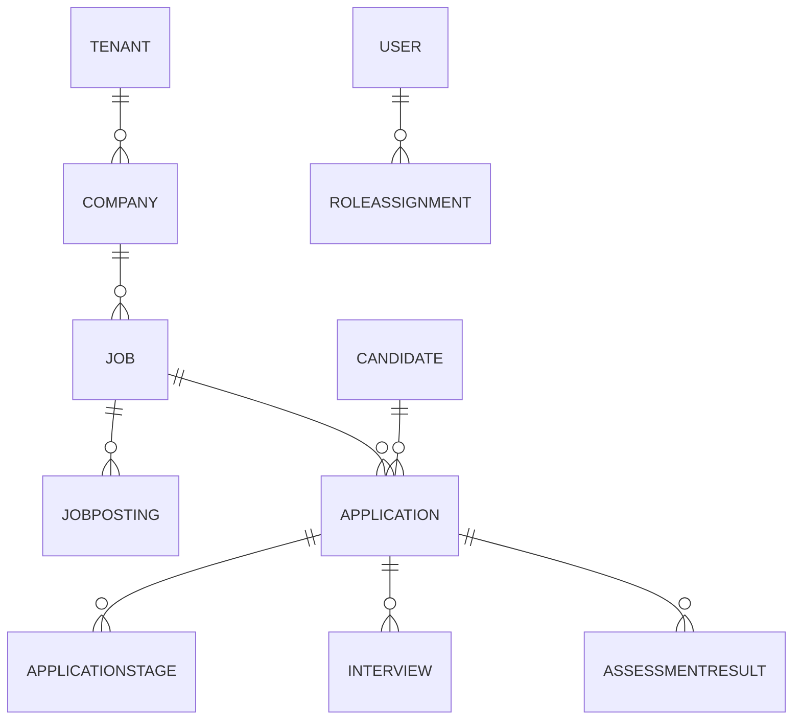

# ATS “LTI Hire” – Documento de Investigación Previa

*(Fases cubiertas: investigación & análisis → casos de uso → modelo de datos → arquitectura de software → roadmap)*

---

## 1. Investigación y análisis

| Dimensión | Hallazgos clave | Implicaciones de diseño |
|-----------|-----------------|-------------------------|
| **Mercado UE / GDPR** | Única región operativa → normas de consentimiento, derecho al olvido, portabilidad y retención ≤ 2 años post‑proceso. | Módulo de compliance desde el MVP: tabla `consents`, retención automática y anonimización batch. |
| **Competencia** (Hays, Randstad) | Grandes firmas combinan ATS internos + servicios de consultoría.<br>Puntos débiles: interfaces rígidas y baja transparencia para candidatos. | Diferenciación de LTI: **UX moderna + IA de matching** + portal de candidato con recursos de auto‑formación. |
| **Volumen** | 300 vacantes/mes · 3 k candidatos/día (pico 30 k). | Necesitamos *multi‑tenant* horizontalmente escalable, partición por empresa (Tenant ID) y búsqueda de texto/eje vectorial. |
| **Idiomas** | ES, EN, FR, DE, IT. | Internacionalización (`i18n`) core; contenidos estáticos en archivos JSON + CMS ligero. |
| **Usuarios y roles** | Recruiter, Hiring Manager, Candidate, External Agency, Admin. | RBAC granular; límites de visibilidad por tenant y por proceso. |
| **Modelo de negocio** | SaaS multi‑tenant con personalización básica (logo, colores, textos). | Tema visual por CSS variables almacenadas en `tenant_settings`. |
| **Valor diferencial requerido** | *Matching semántico avanzado* en el MVP. | Servicio aparte “Talent Match” con embeddings y búsqueda vectorial en Elastic / OpenSearch. |

---

## 2. Casos de uso principales

### 2.1 Actores

- **Admin de LTI** – gestiona tenants, planes y métricas globales.  
- **Recruiter** – crea vacantes, hace *screening*, comunica y avanza estados.  
- **Hiring Manager** – revisa *short‑list*, califica entrevistas, aprueba oferta.  
- **External Agency** – sube candidatos a una etapa inicial y ve solo los suyos.  
- **Candidate** – aplica, realiza pruebas, consulta estado, accede a recursos de mejora.  

### 2.2 Tabla de Casos de Uso (MVP)

| ID | Actor primario | Objetivo | Flujo principal (resumen) |
|----|----------------|----------|--------------------------|
| UC‑01 | Recruiter | Crear y publicar vacante multicanal | Rellena formulario → elige canales → publica. |
| UC‑02 | Recruiter | Recibir y parsear candidaturas | ATS ingiere fuentes → crea perfil → asigna etapa inicial. |
| UC‑03 | Recruiter | Filtrar y priorizar candidatos | Aplica filtros booleanos; “Talent Match” devuelve ranking semántico. |
| UC‑04 | Recruiter + Hiring Manager | Colaborar en *short‑list* | Ver mismos perfiles → añadir notas/ratings → mover a entrevista. |
| UC‑05 | Candidate | Consultar progreso y recursos | Entra al portal → ve timeline + biblioteca de CV/entrevista. |
| UC‑06 | Recruiter | Programar entrevista/prueba | Selecciona slots → invita candidato → ATS actualiza calendario. |
| UC‑07 | Hiring Manager | Emitir decisión y solicitar oferta | Compara finalistas → selecciona → genera oferta PDF. |
| UC‑08 | Recruiter | Cumplir GDPR (retención/olvido) | Programa políticas → tareas batch enmascaran o purgan datos. |
| UC‑09 | Admin LTI | Crear tenant y personalizar branding | Registra empresa → carga logo, define colores → habilita roles. |

> **Nota:** casos de uso extendidos (integraciones HRIS, analítica avanzada, biblioteca de contenidos) quedan para el *roadmap* post‑MVP.

---

## 3. Modelo de datos (vista lógica)



### Entidades clave

| Entidad | Campos clave | Comentarios |
|---------|--------------|-------------|
| **Tenant** | id, name, theme_json | Segmentación multi‑empresa. |
| **User** | id, tenant_id, email, pwd_hash, locale | Incluye Recruiters, Hiring Managers, Agencies. |
| **RoleAssignment** | user_id, role, job_id? | Permite limitar permisos a una vacante concreta. |
| **Candidate** | id, person_data_json, consent_status, resume_file | Datos personales + consentimiento. |
| **Job** | id, company_id, title_i18n, dept, salary_range | Información “única” de la requisición. |
| **JobPosting** | id, job_id, channel, url, posted_at | Historial de canales. |
| **Application** | id, job_id, candidate_id, current_stage, score, agency_id? | Estado vivo de un candidato en una vacante. |
| **ApplicationStage** | application_id, stage, entered_at, exited_at | Audit trail completo. |
| **Interview** | id, application_id, type, schedule_at, outcome, notes_json | Entrevistas y pruebas. |
| **AssessmentResult** | id, application_id, provider, score_json | Enlaces con HackerRank, etc. |
| **ConsentLog** | candidate_id, action, timestamp | Para GDPR. |
| **Notification** | id, user_or_candidate_id, channel, template_id, sent_at | E‑mails, SMS. |
| **EmbeddingVector** | candidate_id OR job_id, vector (array<float16>) | Usado por “Talent Match”. |

---

## 4. Arquitectura de alto nivel

```text
┌──────────────────┐
│  Front‑end SPA   │  (React + i18n)
└──────┬───────────┘
       │ GraphQL / REST
┌──────▼───────────┐
│ API‑Gateway      │──┐
└──────┬───────────┘  │JWT/OIDC
       │              │
┌──────▼───────────┐  │
│ Auth Service     │  │
└──────┬───────────┘  │
       │              │
┌──────▼───────────┐  │
│ Tenant‑Mgmt      │  │
├──────────────────┤  │  Async events (Kafka)
│ Job‑Mgmt         │<─┼──────────┐
│ Application‑Mgmt │  │          │
│ Interview‑Svc    │  │          │
│ Notification‑Svc │  │          │
└──────┬───────────┘  │          │
       │              │          │
┌──────▼───────────┐  │    ┌────▼─────────┐
│ Talent Match Svc │──┘    │ Reporting BI │
└──────┬───────────┘       └────┬─────────┘
       │ Vector search              │
┌──────▼───────────┐               │
│ PostgreSQL (Citus)│<─────────────┘
│ Elastic/OpenSearch│
└───────────────────┘
```

### Decisiones de diseño

| Elemento | Decisión | Razón |
|----------|----------|-------|
| **Micro‑servicios ligeros** | Separar dominios (Auth, Tenant, Core ATS, IA). | Permite desplegar y escalar de forma independiente. |
| **Base de datos – PostgreSQL Citus** | *Shared‑schema* con partición por `tenant_id`. | Simplifica consultas agregadas y minimiza sobrecarga operativa. |
| **Motor de búsqueda** | Elastic/OpenSearch con plugin HNSW para vectores. | Soporta texto libre + *embedding matching*. |
| **Mensajería** | Kafka/Redpanda para eventos (`ApplicationMoved`, `InterviewScheduled`). | Desacopla servicios y alimenta analítica en tiempo real. |
| **Infraestructura** | Kubernetes (EU‑Central) + autoscaling. | Cumple GDPR y soporta picos 10×. |
| **Seguridad** | OAuth 2.1 + OIDC, cifrado AES‑256 at‑rest, TLS 1.3 in‑transit. | Buenas prácticas y RGPD. |
| **Internacionalización** | `react-i18next` + tabla `localized_strings`. | Cambiar idioma sin redeploy. |
| **Branding por tenant** | CSS variables recuperadas desde `tenant_settings`. | Cumple look & feel básico. |

---

## 5. Roadmap y entregables

| Horizonte | Capacidad | Entregable técnico |
|-----------|-----------|--------------------|
| **M‑1 (MVP)** | - Autenticación & RBAC<br>- Multi‑tenant básico<br>- CRUD Vacantes + publicación manual<br>- Ingesta candidaturas (web form + e‑mail)<br>- Pipeline visual<br>- Matching semántico v1 (cosine similarity + TF‑IDF/Embeddings)<br>- Portal candidato con timeline y biblioteca vacía<br>- Branding básico y 5 idiomas<br>- GDPR: consentimiento + export JSON | *Deploy* en *staging* + documentación API (OpenAPI) + guía de onboarding cliente. |
| **M‑2** | - Integración calendario (Google/O365)<br>- Plantillas de comunicación<br>- Módulo entrevistas/pruebas<br>- Reporting core (Time‑to‑Hire, Conversion)<br>- Retención automática / derecho al olvido | Release Candidate + scripts migración. |
| **M‑3 (Launch)** | - Publicación multicanal (LinkedIn, Indeed vía API)<br>- Recursos de mejora profesional (vídeos/PDF, tracking de uso)<br>- SLA & dashboards para Admin LTI<br>- Portal Agencies<br>- Firmas electrónicas (DocuSign / Signaturit) | Versión GA en producción EU, playbooks de escalado y DR. |

---

## 6. Próximos pasos recomendados

1. **Alinear alcance detallado del MVP** con *Product Owner* y *UX Lead* (2‑3 días).  
2. **Sprint 0**: configurar repos, pipeline CI/CD, cuentas Cloud, tablero Jira.  
3. **Diseño técnico detallado** (esquema DB, contratos API, eventos Kafka) – 1 semana.  
4. **Desarrollo iterativo**: 2 sprints de 2 semanas para el MVP.  
5. **Test de carga** simulando 30 k candidaturas/día antes de producción.

---

> Documento generado automáticamente para LTI, **jul 2025**.
