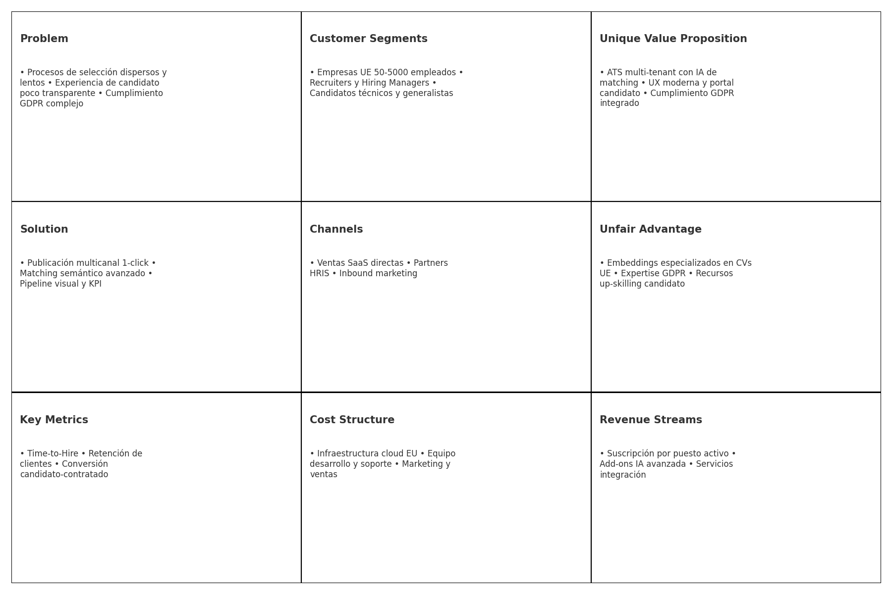
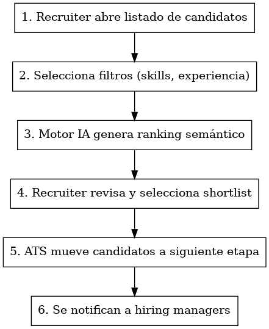
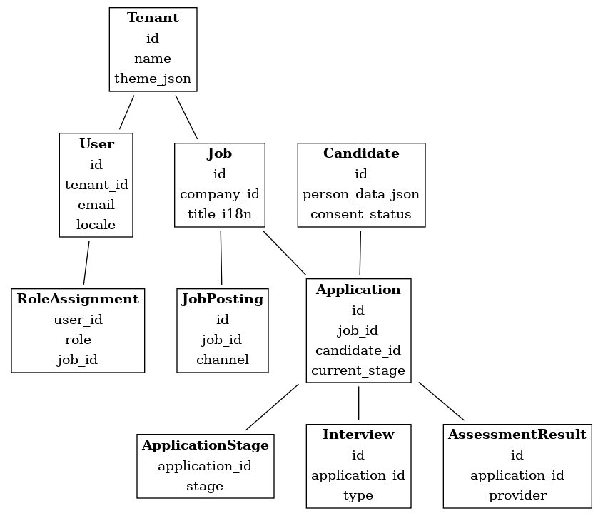
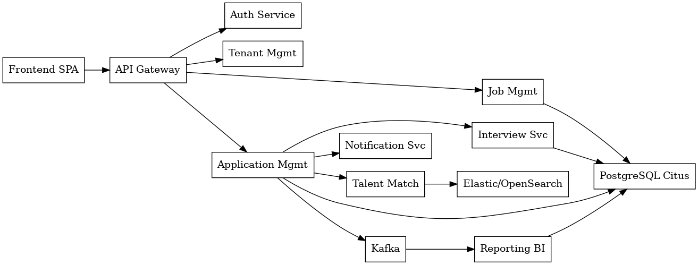
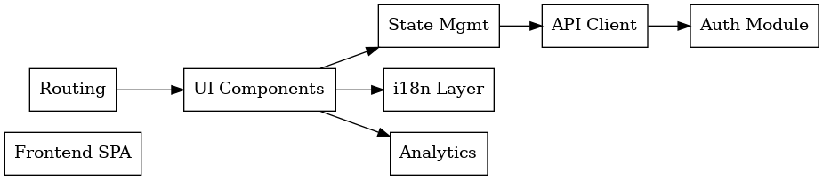

# LTI Hire – Documentación Unificada

> Versión completa (jul 2025) que integra la investigación previa y el diseño del sistema.

---

## 1. Visión general y propuesta de valor

*LTI Hire* es un **Applicant‑Tracking System (ATS) SaaS multi‑tenant** enfocado al mercado europeo y 100 % conforme con GDPR.  
Su propuesta de valor se basa en:

- **Matching semántico impulsado por IA** que reduce en >30 % el *time‑to‑hire*.  
- **Experiencia de candidato superior**: portal con seguimiento en tiempo real y recursos de mejora profesional.  
- **Cumplimiento normativo integrado** (consentimientos, retención, derecho al olvido).  
- Personalización ligera de marca (logo, colores) sin sacrificar velocidad de despliegue.  

Funciones principales del MVP:

1. Publicación multicanal de ofertas en un clic.  
2. Ingesta, parseo y centralización de CV.  
3. Pipeline visual personalizable.  
4. Búsqueda, filtrado y ranking semántico.  
5. Programación de entrevistas y notificaciones.  
6. Análisis KPI básicos y export GDPR.

---

## 2. Investigación y análisis

| Dimensión | Hallazgos clave | Implicaciones de diseño |
|-----------|-----------------|-------------------------|
| **Mercado UE / GDPR** | Única región operativa → normas de consentimiento, derecho al olvido, portabilidad y retención ≤ 2 años post‑proceso. | Módulo de compliance desde el MVP: tabla `consents`, retención automática y anonimización batch. |
| **Competencia** (Hays, Randstad) | Grandes firmas combinan ATS internos + servicios de consultoría. Puntos débiles: interfaces rígidas y baja transparencia para candidatos. | Diferenciación de LTI: **UX moderna + IA de matching** + portal de candidato con recursos de auto‑formación. |
| **Volumen** | 300 vacantes/mes · 3 k candidatos/día (pico 30 k). | Necesitamos *multi‑tenant* horizontalmente escalable, partición por empresa (Tenant ID) y búsqueda de texto/eje vectorial. |
| **Idiomas** | ES, EN, FR, DE, IT. | Internacionalización (`i18n`) core; contenidos estáticos en archivos JSON + CMS ligero. |
| **Usuarios y roles** | Recruiter, Hiring Manager, Candidate, External Agency, Admin. | RBAC granular; límites de visibilidad por tenant y por proceso. |
| **Modelo de negocio** | SaaS multi‑tenant con personalización básica (logo, colores, textos). | Tema visual por CSS variables almacenadas en `tenant_settings`. |
| **Valor diferencial requerido** | *Matching semántico avanzado* en el MVP. | Servicio aparte “Talent Match” con embeddings y búsqueda vectorial en Elastic / OpenSearch. |

---

## 3. Lean Canvas

---

## 4. Casos de uso detallados

### UC‑01 – Crear y publicar vacante

| Elemento | Detalle |
|----------|---------|
| **Actor primario** | Recruiter |
| **Precondición** | El recruiter está autenticado y tiene permiso de creación. |
| **Flujo principal** | 1) Abre módulo “Crear Vacante”. 2) Introduce datos (título, descripción, salario, ubicación, tags). 3) Selecciona canales de publicación. 4) El sistema valida, guarda y publica. 5) Se muestra confirmación y URL de la oferta. |
| **Flujos alternativos** | 3A) Datos incompletos → el sistema resalta errores. 4A) Falla API de un portal → se marca como “Pendiente” y se reintenta. |
| **Postcondición** | Vacante activa en estado “Publicado” y visible en canales. |

### UC‑02 – Recibir y parsear candidaturas

| Elemento | Detalle |
|----------|---------|
| **Actor primario** | Recruiter (evento disparado por Candidate) |
| **Precondición** | Vacante publicada y canales conectados. |
| **Flujo principal** | 1) El candidato envía CV o aplica vía formulario. 2) El ATS recibe el archivo/JSON. 3) Se parsea y normaliza. 4) Se crea/actualiza `Candidate`. 5) Se crea `Application` en etapa “Applied”. 6) Se envía correo de confirmación. |
| **Flujos alternativos** | 3A) CV corrupto → Se almacena como archivo sin parsear y se alerta al recruiter. |
| **Postcondición** | Candidate y Application existen y están ligados a la vacante. |

### UC‑03 – Filtrar y priorizar candidatos

| Elemento | Detalle |
|----------|---------|
| **Actor primario** | Recruiter |
| **Precondición** | Existen candidaturas en estado “Applied”. |
| **Flujo principal** | 1) Recruiter abre listado. 2) Aplica filtros (knock‑out, skills). 3) Motor IA devuelve ranking por score. 4) Recruiter selecciona shortlist. 5) Candidatos pasan a etapa “Pre‑screen”. 6) Se notifican a hiring managers. |
| **Flujos alternativos** | 3A) Motor IA sin resultados relevantes → se usa orden cronológico. |
| **Postcondición** | Lista priorizada y candidatos movidos a la siguiente etapa. |

---

## 5. Modelo de datos (detallado)

Principales entidades: `Tenant`, `User`, `RoleAssignment`, `Candidate`, `Job`, `JobPosting`, `Application`, `ApplicationStage`, `Interview`, `AssessmentResult`, `EmbeddingVector`, `ConsentLog`, `Notification`.

---

## 6. Diseño del sistema a alto nivel

---

## 7. C4 – Componente Front‑end

---

## 8. Roadmap y entregables

| Horizonte | Capacidad | Entregable técnico |
|-----------|-----------|--------------------|
| **M‑1 (MVP)** | - Autenticación & RBAC - Multi‑tenant básico - CRUD Vacantes + publicación manual - Ingesta candidaturas (web form + e‑mail) - Pipeline visual - Matching semántico v1 (cosine similarity + TF‑IDF/Embeddings) - Portal candidato con timeline y biblioteca vacía - Branding básico y 5 idiomas - GDPR: consentimiento + export JSON | *Deploy* en *staging* + documentación API (OpenAPI) + guía de onboarding cliente. |
| **M‑2** | - Integración calendario (Google/O365) - Plantillas de comunicación - Módulo entrevistas/pruebas - Reporting core (Time‑to‑Hire, Conversion) - Retención automática / derecho al olvido | Release Candidate + scripts migración. |
| **M‑3 (Launch)** | - Publicación multicanal (LinkedIn, Indeed vía API) - Recursos de mejora profesional (vídeos/PDF, tracking de uso) - SLA & dashboards para Admin LTI - Portal Agencies - Firmas electrónicas (DocuSign / Signaturit) | Versión GA en producción EU, playbooks de escalado y DR. |

---

## 9. Próximos pasos recomendados

1. **Alinear alcance detallado del MVP** con *Product Owner* y *UX Lead* (2‑3 días).  
2. **Sprint 0**: configurar repos, pipeline CI/CD, cuentas Cloud, tablero Jira.  
3. **Diseño técnico detallado** (esquema DB, contratos API, eventos Kafka) – 1 semana.  
4. **Desarrollo iterativo**: 2 sprints de 2 semanas para el MVP.  
5. **Test de carga** simulando 30 k candidaturas/día antes de producción.

---

### Descarga de diagramas

- [LeanCanvas.png](LeanCanvas.png)  
- [UC01_CreatePublishJob.png](UC01_CreatePublishJob.png)  
- [UC02_ParseApplications.png](UC02_ParseApplications.png)  
- [UC03_FilterPrioritize.png](UC03_FilterPrioritize.png)  
- [DataModel.png](DataModel.png)  
- [HighLevelSystem.png](HighLevelSystem.png)  
- [C4Frontend.png](C4Frontend.png)
